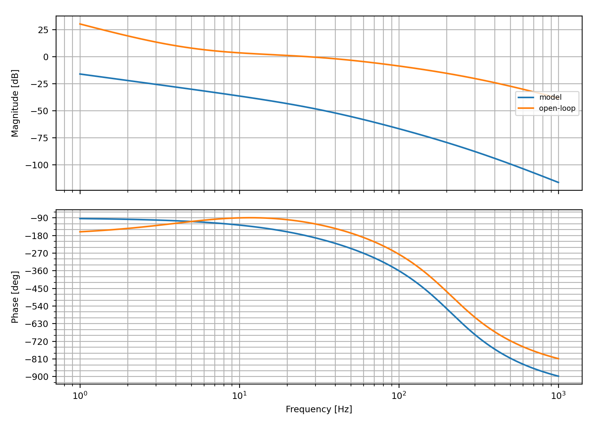
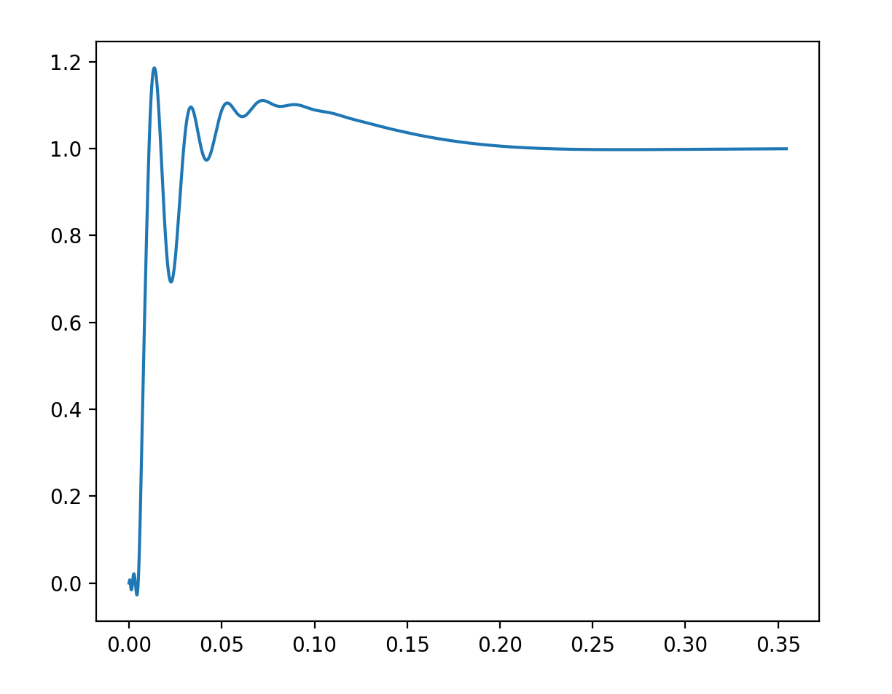

# Open-Loop Diagnostics & Performance Optimization 

This page compiles the diagnosis from the frequency-domain (Bode) and time-domain (Step Response), and performance-based recommended tuning to the PID structure components.

**No python file** is provided with this analysis.

---

## 1. System Performance Observations

### A. Frequency-Domain (Bode Diagram) Characteristics

| Bode Plot of Model and Open-Loop | Time-Domain Step Response |
| :--- | :--- |
|  |  |
| *figure 1.1 Bode Plot of Model and Open-Loop* | *Figure 1.2: Time-domaine step response*|

* **Gain Crossover Frequency:** 

The gain cross-over frequency crosses **$0\text{ dB}$** is in a window spanning **$20\text{ Hz}$ to $30\text{ Hz}$**, and the bandwwidth (**$-3\text{ dB}$**) is around $30\text{ Hz}$**.

* **Phase Margin:** 

At this explicit crossover boundary, the loop phase sits between $-100^{\circ}$ and $-120^{\circ}$. This produces a hight **Phase Margin ($\text{PM}$) of roughly $60^{\circ}$ to $80^{\circ}$**. A OM in this range affords the system a derdamped behavior in the time domain.

* **Model vs. Open-Loop Discrepancy:** 

A comparison of the system model (blue) against the open-loop response (orange) reveals a severe static gain offset. The model’s magnitude curve starts at very low DC gain, which is unusual indicating scaling issue or uncalibrated DC gain. Furthermore, the model's gain magnitude remains at, if not more than **$40\text{ dB}$ lower** than the open-loop gain all frequencies.

### B. Time-Domain (Step Response) Performance

The presence of tiny negative dip in the transient response suggested initially a possible small RHP zero of the model, also known as non-minimum phase, especially coupled with the ringing/oscilations during rise time. However, when combined with the information from the bode plot, the transient behavior is indeed due to PID gains turning and calibration issues instead. Note that a givaway of non-minimum phase system aside from the negative derivative action (induced by RHP zero) is a combined increase in gain magnitude with phase decreases by $90^\circ$ as angular frequency increases

* **Severe Transient Ringing:** 
High-frequency underdamped oscillations during the transient period.

* **Peak Overshoot:** 
The initial transient peak reaches approximately **$1.18$**, which equates to an explicit **$18\%$ overshoot**

* **Settling Time:** 
The system settles into the bounded steady-state within **$0.20\text{ seconds}$**.

* **Steady-State Accuracy:** 
The response settles precisely at **$1.0$**, leaving **zero steady-state tracking error**.

The current performance suggests that the existing implementation utilizes an integrated loop structure comonent of the PID (such as a PI or PID controller) capable of steady-state error.

---

## 2. PID Tuning Recommendations & Action Plan

The current PID structure:

$$
𝐶(𝑠)=𝐾(1 + 1/(𝑇_𝑖 𝑠) + 𝑇_𝑑 𝑠)\\
C(s) = K_p + \frac{K_i}{s} + K_ds
$$
with $K_p =K$, $K_i = \frac{K}{T_i}$ , and $K_d=KT_d$

The current instability stems from an aggressive loop gain structure that drives the system too close to its stability boundaries. To suppress the transient ringing and scale back the overshoot, the structural components must be adjusted as follows:

| Component | Effect | Recommended Action Strategy |
| :--- | :--- | :--- |
| **Proportional ($K_p$)** | Dictates rise velocity; excessively high values force the gain crossover outward, shrinking the phase margin. | **Decrease $K_p$ slightly.** This shifts the open-loop gain crossover frequency downward to a lower frequency range, increasing the system's Phase Margin and directly reducing transient overshoot. |
| **Integral ($K_i$)** | Forces steady-state error to zero, but introduces phase lag that destabilizes transient recovery. | **Maintain $K_i$.** The current steady-state behavior is optimal. Increasing this gain, as further phase lag will cause the system to break into sustained oscillations. |
| **Derivative ($K_d$)** | Provides phase lead ("anticipatory braking") by counteracting rapid error velocity. | **Slightly Increase $K_d$** Injecting more derivative action counteracts the lagging phases near the crossover frequency. This will dampen the transient ringing and smooth out the sharp steps. |

A **recommended PID structure** is to account for filtering the derivative action via a low-pass filter.

$$
C(s) = K_p + \frac{K_i}{s} + \frac{\tau_f}{\frac{\tau_f}{N} s + 1}
$$

Such that $K_d = \tau_f$ and $\mathbf{N}$ is heuristic filter divisor. Typically chose between 10 and 20.

With this modification in mind, there is more granular tuning on the effect of the derivative on the transient dynamics. **As a result it is recommended to reduce $\tau_f$ to lower values to attentuate the oscillations. The step function has high frequency components so filtering some of those high frequencies with ensure less oscillatory transient tracking.**

Anoter consideration, in certain dynamics (e.g. low-intertia motors) is to apply the derivation term exclusively to the output instead of the error, the reason being is that $(C(s))$ transfer function affect the error, and when there is sudden injection of a setpoint (step input) the error derivative is very (impulse) leading to saturation at the actuation 

---

## 3. Summarized Course of Action

+ **Reduce $K_p$ by $15\% -25\%$** to bring the baseline overshoot down.

+ **Incrementally step up $K_d$** to damp the transient high-frequency ringing

+ **Recalibrate the internal System Model's scalar gain by $\approx +40\text{ dB}$** so that it aligns accurately with the empirical open-loop curves for future simulation accuracy.

+ **Modify the PID structure to account for derivative filtering** and choosing $N$ that allows for reduced transient ringing.
