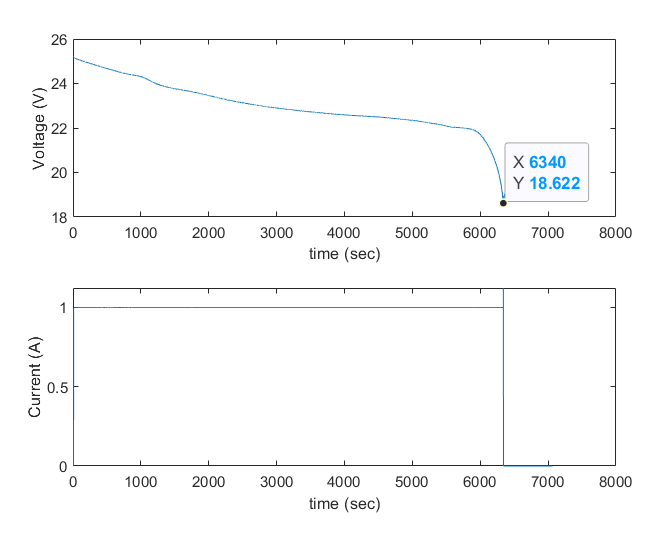
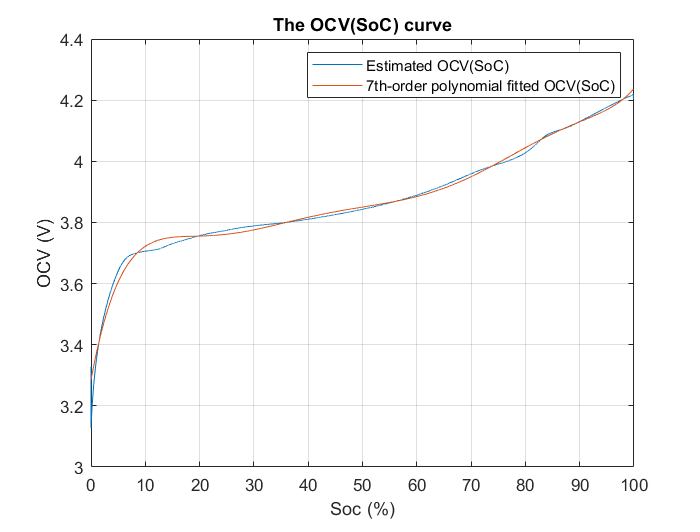
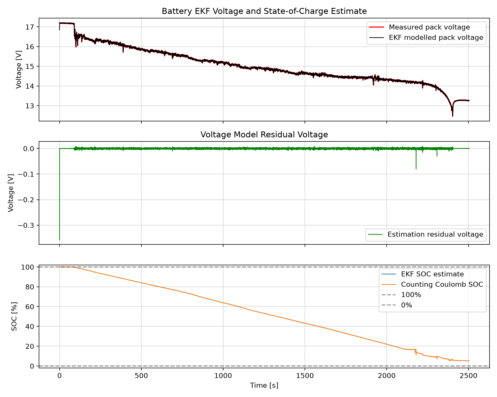

# Battery Management System

This page answers prerequisites information from **battery_discharge.csv** and **batter_flight.csv** about the battery model and properties to implement a Kalman based state of charge (SoC) state estimator

The implementation file is
[`ekf_soc_estimator.py`](/Battery/ekf_soc_estimator.py)

## 1. Battery Capacity

The battery capacity (mAh) or charge capacity is the total amount of electrical charge a battery can move through a circuit.
Identifying from the voltage-current discharge plot (Figure 1-1) the discharge current and the time duration of constant current until the sharp drop gives an estimate about the battery capacity.

$$
Capacity =\frac{1.0\,\mathrm{A}\times 6340\,\mathrm{s}}{3600\,\mathrm{s/hr}} = \mathbf{1.760}\,\mathrm{Ah} = 1760\,\mathrm{mAh}
$$

**Figure 1-1: Voltage-current discharge**

---
## 2. Battery topology

The battery topology that can be ascertained from the plots is that this is a typical lithium cell discharge profile connected in series to provide a maximum full discharge voltage of 25.22 V and a discharge cutoff voltage at around 18.6V. The typical LiPo cell is around 4.2 V fully charged. 

  So there are :
  
  $25.22\,\mathrm{V}\div 4.2\,\text{V per cell}=\mathbf{6}\,\text{cells in series}$

The topology in terms of the voltage provision is 6 cells in series (6S).
In terms of capacity provision, the parallel topology is likely a single string of cells (1P) due to the fact that the capacity is 1800 mA. It is a 6S1P.

The charged battery at time $t<9\ sec$ is $25.227 V$ after which the currect starts to flow (discharge) leading to immediate drop to $25.18V$. Since the cells are serially connected, $V_{cell}= 4.197 \text{V} $. 

At $t = 6342 \text{ sec}$, which is the moment the current drops to $0\ A$, is the transient response of the RC circuit, which gives us a clue about the $\tau$ (time constant of the dynamics of RC).   

At this relaxation period, the $\tau$ is the 63.2% rise time from 18.648 (across the battery) to $\mathbf{ 19.82 V}$.  In another word is $\tau$ is at voltage  

$$
V_{\tau}= 18.648 + 0.632 \times (19.814-18.648) = 19.39 V
$$

which is around $\tau = 6451 - 6340 = 111 \text{ sec}$

If $R_0= 25\ m\Omega$ and $R_1= 12.5\ m\Omega $ 
then

$$
C_{1}=\frac{\tau }{R_{1}}=\frac{111\,\mathrm{s}}{0.0125\,\Omega}=\mathbf{8880}\ \mathrm{F} 
$$

### SoC Coulomb counting:

The coulomb counting provides a discrete approximation of the next state of charge and defined as:

$$
\begin{matrix}
 SoC_{k}=SoC_{k-1}+\frac{I_{k}\cdot \Delta t}{Q_{\text{nom}}\cdot 3600}  &  &  | & I_k <0  \text{  (discharge)}
\end{matrix}
 $$

where $I_k$ and $Q_{nom}$ are the current at instant $k.\delta(t)$ and the nominal battery capacity, respectively. The current $I_k$ is negative of discharge.

### Kirchhoff's Voltage Law (KVL):

This is cell voltage model that related the open source voltage (source) and the internal reactive components of the battery cell

$$
\begin{matrix}
V_{cell}(t)=OCV(SOC)+i(t)\cdot R_{0}+v_{1}(t)
 &  & | & i <0  \text{  (discharge)}
\end{matrix}
$$

where the voltage is governed by a dynamic **first-order model ( Thevenin Equivalent Model)**:

$$
\frac{dv_{1}(t)}{dt}=-\frac{1}{R_{1}C_{1}}v_{1}(t)+\frac{1}{C_{1}}i(t)
$$

Because the topology does not change as there is no parallel configuration. The current is not divided, so the current flowing through the cells is the same.

from the [`battery_flight.csv`]('battery_flight.csv') data, the max cell voltage for the **4S1P** is **$4.30 \text{ V}$**.

**Figure 1-2: OCV function of SoC**

**Figure 1.2** shows the relationship between the OCV voltage computed from the Kirtchoff's law and the estimated SoC obtained from Coulomb Counting.

To find an estimate of the battery capacity from the current data, trapezoidal equation is used for discrete data points, the equation to sum up the area under your current-vs-time curve is: 

$$
Q_{\text{act}}=\frac{1}{3600}\sum_{k=2}^{N}\left(\frac{\lvert I_k\rvert+\lvert I_{k-1}\rvert}{2}\right)(t_k-t_{k-1})
$$

The battery capcity of 4S1P with the energy/current draw provided, is $\mathbf{Q = 10000 \text{ mAh}}$

Because the current signal is noisy, the estimated would benefit from sliding window averaging or filter-based estimation.

---
## 3. Extended Kalman Filter

The estimator in [`ekf_soc_estimator.py`](../Battery/ekf_soc_estimator.py) uses a first-order Thevenin battery model and estimates two states for one cell: the RC voltage $v_1$ and state of charge $z=SoC$. 

The measured pack voltage is divided by six before estimation; the plotted model voltage is converted back to pack voltage.

### Parameters used

| Parameter | Value | Meaning |
|---|---:|---|
| Nominal capacity, $Q_{nom}$ | $10000\text{ mAh}$ | Coulomb-counting capacity |
| Series cells | 4 | Pack-to-cell voltage conversion |
| $R_0$ | $0.025\ \Omega$ | Cell ohmic resistance |
| $R_1$ | $0.0125\ \Omega$ | Cell polarization resistance |
| $\tau$ | $111\text{ s}$ | RC time constant |
| $C_1=\tau/R_1$ | $8880\text{ F}$ | Cell polarization capacitance |
| Initial SoC | $0.999$ ($99.9\%$) | Initial state at the first sample |
| Initial polarization voltage | $0\text{ V}$ | Initial state at the first sample |
| Initial covariance, $P_0$ | $diag\ (0.01,\,0.05)$ | Variances for the state $[v_1, SoC]$ |
| Process covariance, $Q$ | $diag\ (10^{-4},\,10^{-7})$ per sample | Process/State-model uncertainty |
| Voltage measurement variance, $R_v$ | $1.96 \times 10^{-6}\text{ V}^2$ | Equivalent standard deviation: $10\text{ mV}$ per cell |

The CSV current is positive for discharge, while the estimator defines positive current as charging. 

My script uses therefore the negative sign to designate discharge 

$$
I_k=-I_{discharge,k}
$$ 

With this convention, discharge current is negative and reduces SoC. 

Regarding $Q$ and $P_0$, they are assumed because current and voltage measurement are not sources for characterizing the initial state error covariance and process covariance, since they require independent state references or expliticit prior quantification 
​
The measurement covariance or noise variance in this case was estimated from a detrended 60 seconds window portion of the voltage signal from "battery_flight.csv" data and estimated to be about 5.6 mV for the battery, or 1.4 mV per cell (4S1P).  

The OCV function model used by the code is a high-order polynomial chosen so to handle the convex changes.

$$
OCV(z) = \lambda^T z     
$$ 

where $z = [z^7, z^6,  z^5, z^4, z^3, z^2, z^1, 1]^T$ and $\lambda$ is the parameter vector.

### EKF formulation

The state vector and its covariance are

$$
x_k=
\begin{bmatrix}
v_{1,k} \\
z_k
\end{bmatrix}  
\in R^2, 
\qquad P_k= Cov(x_k) \in R^{2 \times 2}
$$

For the elapsed time $\Delta t_k=t_k-t_{k-1}$, the zero-order-hold prediction uses the previous current sample ( $I_k$ remains constant during $\Delta t_k$ ). 

### Prediction:

Let $a_k=e^{-\Delta t_k/\tau}$. 

The discrete state prediction (See [Appendix](#Appendix) for derivation) is

$$
\begin{aligned}
v_{1,k}^{-}&=a_kv_{1,k-1}+R_1(1-a_k)I_{k-1} ,\\
z_k^{-}&= z_{k-1}+\frac{\Delta t_k I_{k-1}}{3600 \times Q_{nom}}  &;   z_k \in [0, 1] ,\\
F_k&=
\begin{bmatrix}
a_k & 0 \\
0 & 1
\end{bmatrix} ,\\
P_k^{-}&=F_kP_{k-1}F_k^\mathsf{T}+Q
\end{aligned}
$$

The voltage measurement is the terminal cell voltage, not an OCV-corrected voltage. The predicted measurement and its Jacobian are

$$
\begin{aligned}
\hat V_k^{-}&=OCV(z_k^{-})+v_{1,k}^{-}+R_0I_k,\\
H_k&=\begin{bmatrix}1&\left.\dfrac{dOCV}{dz}\right|_{z_k^{-}}\end{bmatrix},\\
\nu_k&=V_{cell,k}-\hat V_k^{-},\\
S_k&=H_kP_k^{-}H_k^\mathsf{T}+R_v,\\
K_k&=P_k^{-}H_k^\mathsf{T}S_k^{-1}
\end{aligned}
$$

The gain $K_k$ weights the voltage residual $\nu_k$ to correct both states. 

The precomputed cofficients of the polyniomial used to estimate **$OCV(Soc)$** are:

| **Coefficient** | $P_7$ | $P_6$ | $P_5$ | $P_4$ | $P_3$ | $P_2$ | $P_1$ | $P_0$ |
|---|---|---|---|---|---|---|---|---|
| **Value**| 156.99 | -599.64 | 924.67 | -738.43 | 326.25 |  -78.49  |  9.61 |   3.28

Where $P_i$ are the coefficient to the 7th degree polynomial. The Jacobian of which with respect the state is computed during the correction stage.

### Correction:

$$
x_k=x_k^{-}+K_k\nu_k 
$$
$$
P_k=(I-K_kH_k)P_k^{-}(I-K_kH_k)^\mathsf{T}+R_vK_kK_k^\mathsf{T}
$$

The SoC is clipped to $[0,1]$ in the corrected step. For numerical stability, I use Joseph form for covariance update of $P_k$

The SoC in both the predicted or corrected step is clipped to $[0,1]$. Also I zero in the implementation the SoC row and column of the covariance. The idea is to keep uncertainty consistent with projecting SoC back into its physical range $[0, 1]$, despite the fact that covariance is corrected at every sample.

### Estimated voltage and SoC

The figure compares measured pack voltage with voltage reconstructed from the corrected EKF states, and shows the estimated SoC on the lower axis. It was generated from `Telemetry/battery_discharge.csv`; the first sample uses the initialized state and subsequent samples perform prediction and voltage correction.

**Figure 3-1: EKF measured and modelled pack voltage with estimated SoC**

The upper plot is calculated as 

$$
\hat V_{pack,k} = 6 \times [OCV(z_k)+v_{1,k}+R_0I_k]
$$

 It follows the overall discharge and relaxation profile, but the minimum modeled voltage is about $18.96\text{ V}$ while the measured minimum is $18.58\text{ V}$; the low-voltage cutoff is therefore under-predicted by about $0.37\text{ V}$. The lower trace falls from $99.90\%$ to $30.88\%$ over this data set. This is an EKF estimate, not a ground-truth SoC measurement; its accuracy depends on the capacity, OCV curve, RC parameters, current sign, and voltage data.

## Appendix

Obtaining discrete solution of the first-order linear ODE with the current $ZOH$ assumption

The continuous differential equation as stated above for the RC voltage 

$$
\frac{dV_{1}(t)}{dt}=-\frac{1}{\tau _{1}}V_{1}(t)+\frac{1}{C_{1}}I(t)
$$

Where $\tau_1 = R_1 C_1$

Rearranging it into standard linear form gives: 

$$
\frac{dV_{1}(t)}{dt}+\frac{1}{\tau _{1}}V_{1}(t)=\frac{1}{C_{1}}I(t)
$$

Multiplying the equation by an integrating factor $e^{\frac{t}{\tau_1}}$

$$
e^{\frac{t}{\tau _{1}}}\frac{dV_{1}(t)}{dt}+\frac{1}{\tau _{1}}e^{\frac{t}{\tau _{1}}}V_{1}(t)=e^{\frac{t}{\tau _{1}}}\frac{1}{C_{1}}I(t)
$$

The left side simplifies to a single derivative using the product rule:

$$
\frac{d}{dt}\left[e^{\frac{t}{\tau _{1}}}V_{1}(t)\right]=e^{\frac{t}{\tau _{1}}}\frac{1}{C_{1}}I(t)
$$

Integrating both sides in the duration of the sampling time 
$t_{k+1} - t_k = T_s$

$$
\int _{t_{k}}^{t_{k+1}}\frac{d}{dt}\left[e^{\frac{t}{\tau _{1}}}V_{1}(t)\right]dt=\int _{t_{k}}^{t_{k+1}}e^{\frac{t}{\tau _{1}}}\frac{1}{C_{1}}I(t)dt
$$

Evaluating the left side directly yields: 

$$
\left[e^{\frac{t}{\tau _{1}}}V_{1}(t)\right]_{t_{k}}^{t_{k+1}}=e^{\frac{t_{k+1}}{\tau _{1}}}V_{1,k+1}-e^{\frac{t_{k}}{\tau _{1}}}V_{1,k}
$$

The ZOH assumptions allows us to write:

$$
\int _{t_{k}}^{t_{k+1}}e^{\frac{t}{\tau _{1}}}\frac{1}{C_{1}}I(t)dt=\frac{I_{k}}{C_{1}}\int _{t_{k}}^{t_{k+1}}e^{\frac{t}{\tau _{1}}}dt
$$

Since the resistance $R_1$:

$$
R_1 = \frac{\tau _{1}}{C_{1}}
$$

Then

$$
\int _{t_{k}}^{t_{k+1}}e^{\frac{t}{\tau _{1}}}\frac{1}{C_{1}}I(t)dt = 
R_{1}I_{k}\left(e^{\frac{t_{k+1}}{\tau _{1}}}-e^{\frac{t_{k}}{\tau _{1}}}\right)
$$

Finally, with the left side and right side simplified: 

$$
e^{\frac{t_{k+1}}{\tau _{1}}}V_{1,k+1}-e^{\frac{t_{k}}{\tau _{1}}}V_{1,k}=R_{1}I_{k}\left(e^{\frac{t_{k+1}}{\tau _{1}}}-e^{\frac{t_{k}}{\tau _{1}}}\right)
$$

To solve for $V_{1,k+1}$, multiply every term in the equation by 
$e^{-\frac{t_{k+1}}{\tau _{1}}}$: 

$$
V_{1,k+1}-e^{\frac{t_{k}-t_{k+1}}{\tau _{1}}}V_{1,k}=R_{1}I_{k}\left(1-e^{\frac{t_{k}-t_{k+1}}{\tau _{1}}}\right)
$$

Substituting $t_k - t_{k+1} = -T_s$ provides the discrete solution to the first-oder ODE: 

$$
V_{1,k+1}=e^{-\frac{T_{s}}{\tau _{1}}}V_{1,k}+R_{1}\left(1-e^{-\frac{T_{s}}{\tau _{1}}}\right)I_{k}
$$

## References

1- Xiangdong Cui, Yanqi Huang, Xiaomei Wu, Kalman filter method with correction of open-circuit voltage curve for estimating SOC of lithium-ion batteries, Ain Shams Engineering Journal, Volume 16, Issue 12, 2025, 103822, ISSN 2090-4479, https://doi.org/10.1016/j.asej.2025.103822. 

