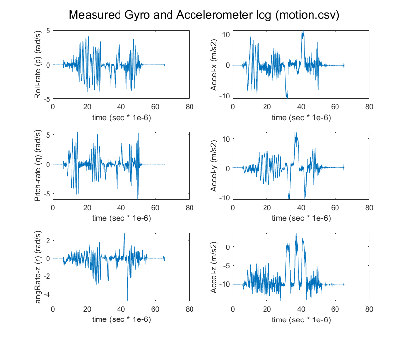
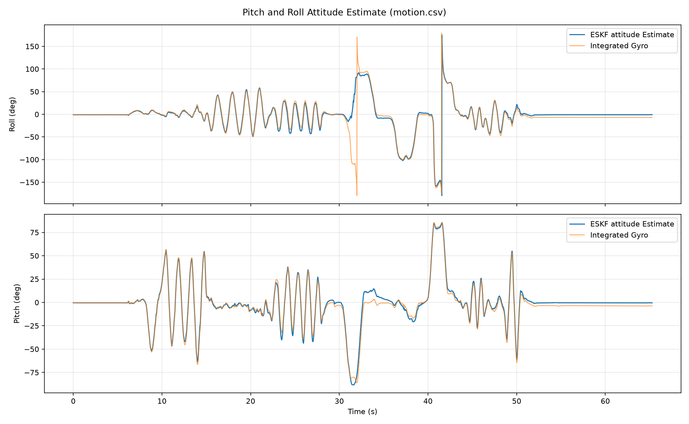

# IMU Attitude Fusion

This document describes the estimator implemented in [`eskf_attitude.py`](eskf_attitude.py) and the output plot generated from `Telemetry/motion.csv`.

## Filter choice: ESKF

The [`motion.csv`](motion.csv) data contains timestamped three-axis gyroscope and accelerometer samples, with no GPS lock (NED position and velocity) or magnetometer vector reading. The state estimation reduces to attitude estimation instead of a full 15 or 18 state estimation tracking position, velocity, orientation, and biases.

An error-state Kalman filter (ESKF) is a good fit because orientation is represented by a unit quaternion, and is directly integrated prior to prediction. The ESKF propagates that quaternion as the nominal state and runs a conventional Kalman filter on a small local attitude error plus gyro-bias error. This avoids treating the four quaternion coefficients as unconstrained Euclidean states as opposed to the EKF which would require at each iteration preserving the unit-quaternion constraint. This normalization effort is added uncalled for computational effort. 

The implemented error state has six components:

$$
\delta x = \begin{bmatrix}\delta\theta & \delta b_g\end{bmatrix}^T,
$$

where $\delta\theta\in\mathbb{R}^3$ is the local attitude error (roll, pitch, yaw) in radians and $\delta b_g\in\mathbb{R}^3$ is the gyroscope-bias error in rad/s. This is an attitude ESKF, not a 15-state position/velocity/attitude ESKF: the CSV does not supply measurements that would correct inertial position or velocity drift.

## Remarks on Sampling

The file provides 9,073 samples spanning about 65.28 seconds. We convert the timestamps to seconds. The median interval is 8.00 ms, with intervals mostly between roughly 5 and 10 ms and occasional larger gaps. This translate to between sample rate of 100 to 200 Hz 

*Figure 1-1: Raw Gyro and Accelerometer reading*

## State-space model and initialization

The nominal state consists of the scalar-first quaternion $q=[q_w,q_x,q_y,q_z]^T$ and gyroscope bias $b_g\in\mathbb{R}^3$. The local ESKF error state and its covariance are

$$
\delta x = \begin{bmatrix}\delta\theta\\\delta b_g\end{bmatrix}\in\mathbb{R}^6,
\qquad P\in\mathbb{R}^{6\times6}.
$$

Here $\delta\theta$ is a small three-axis attitude (roll, pitch, yaw) error in radians and $\delta b_g$ is a three-axis bias error in rad/s. The filter stores and propagates the nominal quaternion and bias; it estimates their small errors with the Kalman filter. The error state is reset to zero after each accepted correction.

The gyroscope model is

$$
\omega_m = \omega + b_g + n_g,
$$

where $\omega_m$ is the measured angular velocity, $\omega$ is the true body angular velocity, and $n_g$ is gyro measurement noise. Bias is modeled as a slowly varying random walk.

The first 0.5 s of data initializes the nominal state. The mean gyro sample is taken as the initial bias. The mean accelerometer vector is aligned to NED frame of reference, $g_w=[0,0,-1]^T$, to initialize roll and pitch. We assume the platform on which the sensors are straped-down is initially stationary. No heading information is provided, so the initial yaw is an arbitrary value, since rotation about gravity vector produces the same accelerometer direction

## ESKF: Gyro measurement and Prediction Step

A standard strapdown gyroscope measurement vector $\omega_{raw}$ is modeled as:

$$
\mathbf{ \omega}_{raw}= \mathbf{M}\mathbf{\omega }_{B}+\mathbf{b}+\mathbf{n}
$$

To isolate meaningful true angular rate $\mathbf{\omega }_{B}$ from the raw measurement, typically this step is performed: 

$$
\mathbf{\omega }_{B}=\mathbf{M}^{-1}\left(\mathbf{\omega }_{raw}-\mathbf{b}-\mathbf{n}\right)
$$

where 

$\mathbf{M}$: is a calibration matrix that captures axes-misalignment and any scale factors.

$\mathbf{b}$: is the gyro-bias, which includes the turn-on bias and the random walk process based bias.  

$\mathbf{n}$: is the high-frequncy noise component. 

Assuming aligned gyro and accelerometer data, we simplify the model. At every sample, the measured gyro is the input to the attitude propagation, with bias-corrected rate

$$
\hat\omega_k=\omega_{m,k}-b_{g,k}
$$

$\hat\omega_k$ is a bias-corrected angular rate vector

**Attitude Integration:**

The continuous nominal quaternion equation is

$$
\dot q = \frac{1}{2}q\otimes\begin{bmatrix}0\\\hat\omega\end{bmatrix},
\qquad \dot b_g=0
$$

between bias-noise increments. The gyro is therefore used in the prediction step, not as an independent measurement correction. Accelerometer samples do not drive this propagation.

For the measured interval $\Delta t_k$, theoretically the angular rate is integrated as a rotation vector $\rho_k=\hat\omega_k\Delta t_k$. The quaternion marches the rotation via quaternion multiplication 

$$
\qquad
q_{k+1}^- = q_k \otimes \begin{bmatrix}
\cos(\|\rho_k\|/2)\\
\dfrac{\rho_k}{\|\rho_k\|}\sin(\|\rho_k\|/2)
\end{bmatrix}
$$

The implementation uses the corresponding small-angle approximation when $\|\rho_k\|$ is near zero, then normalizes the quaternion. Actual timestamp differences are used for $\Delta t_k$. 
$\dfrac{\rho_k}{\|\rho_k\|}$ is the unit vector of **$\rho_k$**  

**Discrete-Time Integration**

We use a more numerically stable zero-order hold update discrete integration instead of the continuous integration.

$$
q_{k+1}=\left[\mathbf{I}_{4\times 4}\cos \left(\frac{\|{}\omega_{B}\|{}\Delta t}{2}\right)+\frac{1}{\|{}\omega_{B}\|{}}\Omega (\omega_{B})\sin \left(\frac{\|{}\omega_{B}\|{}\Delta t}{2}\right)\right]q_{k}
$$

$$
\mathbf{q}_{k+1}=\frac{\mathbf{q}_{k+1}}{\|{}\mathbf{q}_{k+1}\|{}}
$$

where 

$$\Omega (\omega_{B})=\left[\begin{matrix} 0 & -\omega_{x} & -\omega_{y} &-\omega_{z}\\ \omega_{x} & 0 & \omega_{z} & -\omega_{y} \\ \omega_{y} &-\omega_{z} & 0 & \omega_{x}\\ \omega_{z} & \omega_{y} &-\omega_{x} & 0 \end{matrix}\right]
$$

Linearizing the error-state dynamics gives

$$
\delta\dot x = F_c\delta x+G w 
$$

Where : 

$$
F_c=\begin{bmatrix}-[\hat\omega]_{\times}&-I\\0&0\end{bmatrix} 
$$

$$
G=\begin{bmatrix} -I & 0 \\  0 & I\end{bmatrix} 
$$

$$
w= \begin{bmatrix} n_g \\ n_{bg} \end{bmatrix} 
$$

$w$ is the process-noise vector (not the same as the angular-rates $\omega$), containing gyro noise and gyro-bias random-walk noise, and $I$ is the identity matrix. Here $\hat\omega$ is the bias-corrected body angular-rate vector, not the noise term.

The operator $[\omega]_\times$ is the skew-symmetric matrix satisfying $[\omega]_\times u = \omega\times u$ ($u$ is an arbitray vector)

The **first-order** discrete transition and discrete process covariance:

$$
F_k=I_6+F_c\Delta t_k
=\begin{bmatrix}I-[\hat\omega_k]_\times\Delta t_k&-I\Delta t_k \\
0&I\end{bmatrix}
$$

$$
Q_k= \begin{bmatrix} \sigma_g^2\Delta t_k I_3 & 0  
\\
0 & \sigma_{bg}^2\Delta t_k I_3
\end{bmatrix}
$$

$$
P_{k+1}^-=F_kP_k^+F_k^T+Q_k.
$$

In this implementation, $\sigma_g=0.015$ and $\sigma_{bg}=0.0005$ in the code's assumed noise units. These are initial tuning assumptions, not values estimated from a sensor datasheet.

## ESKF: Measurement Model and Update of Accelerometer

The accelerometer measures specific force, which contains gravity plus vehicle translational acceleration (with sign dependent on the sensor convention). A reference to gravity is provided by the direction of its translational acceleration. This implementation uses the observed stationary convention in the data, where the initial accelerometer mean points approximately along negative body Z.

Let $a_m$ be the three-axis accelerometer sample, $R(q)$ the Body-to-NED direction cosine matrix (DCM), and $g_{n}=[0,0,-1]^T$ the unit gravity direction in NED coordinates. The normalized direction measurement and predicted direction are

$$
z_{a,k}=\frac{a_{m,k}}{\|a_{m,k}\|},
\qquad
h(q_k^-)=R(q_k^-)^Tg_n,
\qquad
r_k=z_{a,k}-h(q_k^-).
$$

For the right-multiplicative attitude error used by the code, the linearized measurement equation is

$$
r_k\approx H_k\delta x_k+v_k,
\qquad
H_k=\begin{bmatrix}[h(q_k^-)]_\times&0_{3\times3}\end{bmatrix},
\qquad
v_k\sim\mathcal{N}(0,R_k).
$$

Thus this is a three-component direction observation of a six-component error state. It directly observes tilt errors, but has no direct sensitivity to gyro bias in a single update; bias is adjusted indirectly through covariance coupling over time. The accelerometer correction is not the source of translational velocity or position in this filter.

For an accepted sample, the standard Kalman update is

$$
S_k=H_kP_k^-H_k^T+R_k,
\qquad
K_k=P_k^-H_k^TS_k^{-1},
\qquad
\delta x_k=K_kr_k.
$$

We then injects the correction into the nominal state:

$$
q_k^+=q_k^-\otimes \begin{bmatrix}
\cos(\|\delta\theta_k\|/2)\\
\dfrac{\delta\theta_k}{\|\delta\theta_k\|}\sin(\|\delta\theta_k|/2)
\end{bmatrix}
$$
$$
b_{g,k}^+=b_{g,k}^-+\delta b_{g,k}.
$$

Covariance uses the numerically stable Joseph form and is transformed back to the new local attitude-error coordinates:

$$
P_{Joseph}=(I-K_kH_k)P_k^-(I-K_kH_k)^T+K_kR_kK_k^T
$$

The small-angle reset Jacobian is applied to the attitude block, after which the conceptual error state is reset to $\delta x=0$ and the corrected nominal state continues to the next gyro sample.

Extracting the pitch $\theta$ and roll $\phi$ using the quaternion components :

$$
\phi =\text{atan2}\left(2(q_{w}q_{x}+q_{y}q_{z}),\,1-2(q_{x}^{2}+q_{y}^{2})\right)
$$
$$
\theta =\text{arcsin}\left(2(q_{w}q_{y}-q_{z}q_{x})\right)
$$

Refer to appendix for the relationship between DCM and quaternion based attitude 

## **Summary of Steps:**

**Initialization:**
- In this step, mean gyro and mean accelerometer over the initial window. We set initial gyro bias and initial roll/pitch orientation; yaw remains arbitrary.

**Prediction:**
- In this step, we integrate the 3-axis gyro's angular rates through  quaternion representation and propagate error covariance.

** Update:**
- We incorporate the three-axis accelerometer vector samples. We compare the measured acceleration vector with a predicted gravity directions to correct attitude and maintain boundaed gyro-bias components.

For comparison purposes, we solve the gyro signal integrated in time  with initial mean bias substracted, but does not receive accelerometer corrections or estimate subsequent bias random-walk/integration.

## Incomplete Attitude Estimate

Gravity vector provide information about the direction of the local vertical but no information regardng the rotation about that direction. If the vehicle rotates about local NED vertical axis, $R(q)^Tg_w$ is unchanged. Consequently, the gravity measurement Jacobian has no observable yaw component: the accelerometer update can correct roll and pitch, but won't have the abiloty to yaw-correct. The initial accelerometer alignment therefore leaves heading arbitrary, and the yaw-axis gyro bias cannot be reliably estimated from this sensor pair alone.

Yaw is propagated by integrating the gyro component around the vertical direction. Any residual bias accumulates over time; approximately, a constant yaw-rate bias error $\delta b_z$ creates heading error $\delta\psi(t)\approx\delta b_z t$, in addition to integrated gyro noise. Although computed and integrated, the yaw is not plotted. An absolute heading reference such as a magnetometer, vision, or digital compass is needed to process the drift arising from yaw's bias.

### Dynamic-acceleration rejection

The correction is not applied blindly. The implementation:

- Rejects a sample if its acceleration magnitude differs from $g=9.80665\ \mathrm{m/s^2}$ by more than 2.5 $\mathrm{m/s^2}$.
- Increases accelerometer measurement uncertainty as the magnitude departs from gravity.
- Rejects the direction measurement if its normalized innovation squared exceeds 16.27 (a 3D chi-square gate at approximately 99.9%).

These checks reduce the chance that translational acceleration is mistaken for tilt. They do not perfectly distinguish gravity from sustained acceleration; that requires additional sensors or a richer motion model.

## Estimation Result

We compare in Figure 1-2 the Kalman-estimated roll and pitch with the integrated component of the measured gyro vector (raw angular rates).

*Figure 1-2: ESKF Roll and Pitch Estimation*

The accelerometer corrections keep the roll and pitch estimates bounded relative to gyro only integration. The estimate of the attitude is incomplete because of missing relative or true north-relative information, and hence the yaw information  is not corrected by the accelerometer and drifts when gyro bias is integrated. The yaw is an absolute heading, and is estimated to be about -80 degrees from its arbitrary initial heading for the duration of integration. 

# Appendix 

### Quaternion, DCM, and Euler angles

The quaternion remains the filter's orientation state because it has no Euler-angle singularity and is convenient for incremental rotation integration. For scalar-first $q=[w,x,y,z]^T$, the code converts it to the body-to-world DCM

$$
R(q)=\begin{bmatrix}
1-2(y^2+z^2)&2(xy-zw)&2(xz+yw)\\
2(xy+zw)&1-2(x^2+z^2)&2(yz-xw)\\
2(xz-yw)&2(yz+xw)&1-2(x^2+y^2)
\end{bmatrix}.
$$

Euler angles are calculated from this DCM for reporting and plotting only; they are not propagated as the filter state. With the roll-pitch-yaw convention used by the code:

$$
\phi=\text{atan2}(R_{32},R_{33}) 
$$
$$
\theta=\text{atan2}(-R_{31},\sqrt{R_{32}^2+R_{33}^2}) 
$$
$$
\psi=\text{atan2}(R_{21},R_{11})
$$

where $\phi$ is roll, $\theta$ is pitch, and $\psi$ is yaw in radians. 