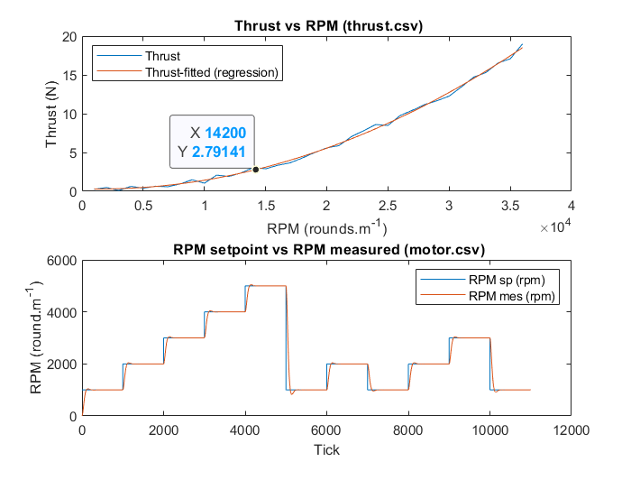
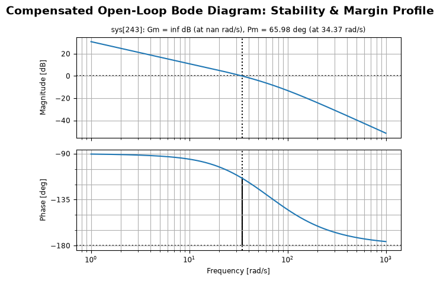
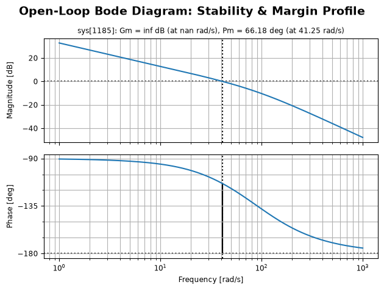
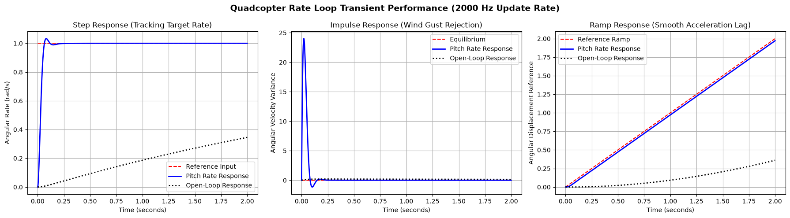
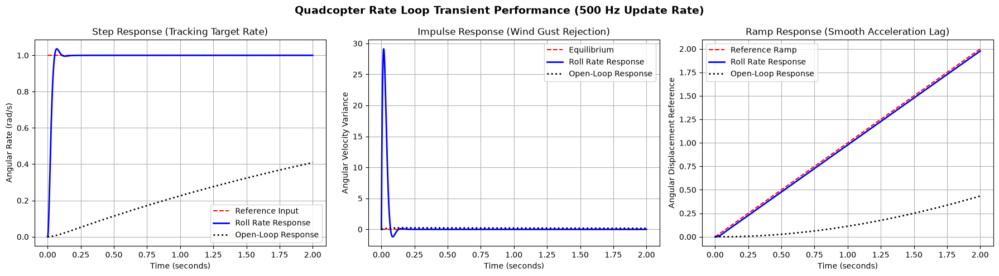

# Problem 3: 
**Quadcopter Model**

Below we answer the questions to problem 3. The implementations are provided in the following python programs:

**Pitch axis**

File: [`pitch_compensator.py`](RateControl/pitch_compensator.py)

The script models one rotational axis as a SISO loop after allocating motor command changes through a pitcher mixer.

**Roll axis**

File: [`roll_compensator.py`](RateControl/roll_compensator.py)

Each script models one axis body-expressed rotational rate as a SISO loop with motor commands allocation through a roll mixer.

---
# 1- Expected hover RPM

The thrust per each motor is :

$$
T_{i}=C_{T} \cdot \rho \cdot n^{2} \cdot D^{4}
$$

Simplified to 

$$
T_i \approx k_{thrust} \cdot \omega^2
$$

where $\omega$ is the angular speed in rad/s

A hover state is when the **net** total forces and moments are zeros

$$
\begin{aligned}
\sum_i F_i &= 0 \\
\sum_i M_i &= 0
\end{aligned}
$$

The thrust per motor required to balance the weight is:

$$
T_{motor} = \frac{m.g}{4}
$$

For a total mass of $1.14 Kg$, the thrust per motor required is $2.795 N$

From the figure 3-1, the RPM corresponding to required thrust per motor is $ \mathbf{14250 RPM}$

*Figure 1-1: Thrust (N) vs RPM*

---
# 2- Nonlinear MISO models

The drone X configuration is symmetric, so body x-axis is forward across motor 1 & 2 with
 the origin at the CG, the body y-axis is outward across motor 2 and 3, while z-axis is down through the 
CG completing the right-hand rule.

Motor 1 (Front-Left): $+x, -y$ [CW]

Motor 2 (Front-Right): $+x, +y$ [CCW]

Motor 3 (Rear-Right): $-x, +y$ [CW]

Motor 4 (Rear-Left): $-x, -y$ [CCW]

The pitch motion occurs when there is a differential between the thrust of $(F_1 + F_2)$ and $(F_3 + F_4)$ 
The roll motion occurs when there is a differential between the thrust of $(F_1 + F_4)$ and $(F_2 + F_3)$

We assume proportional relationship between the motor thrust and angular speed of the motor :

$$
T_i = k_{thrust} \cdot \omega^2
$$

where $k_{thrust}$ is the thrust coefficient.

Provided that : 

$$
\begin{aligned}
L_x &= 0.07\,\mathrm{m} \\
L_y &= 0.09\,\mathrm{m}
\end{aligned}
$$ 

where $L_x$ and $L_y$ is the moment arm length of the fuselage/frame in body's x and y axes direction, respectively

$$
\begin{aligned}
L_{body} &= 0.08\,\mathrm{m} \\
W_{body} &= 0.04\,\mathrm{m}
\end{aligned}
$$ 

Where $L$ and $W$ are half of the length (assumed) and width of fuselage/frame, respectively.

Assuming a rectangular cuboid frame:

$$
J_{xx} (body) = \frac{1}{12} \times m_b  W_{body}^2= \mathbf{1.33 \times 10^{-4} kg.m^2}
$$

$$
J_{yy} (body) = \frac{1}{12} \times m_b L_{body}^2= \mathbf{5.33 \times 10^{-4} kg.m^2}
$$

$$
J_{xx} (motor) = 4 \times m_m L_y^2 = 4 \times 0.035 \times (0.09 m)^2= 
\mathbf{1.134 \times 10^{-3} kg.m^{2}}
$$

$$
J_{yy} (motor) = 4 \times m_m L_x^2 = 4 \times 0.035 \times (0.07 m)^2= \mathbf{6.860 \times 10^{-4} kg.m^{2}}
$$

$$
J_{xx} =  J_{xx} (body) + J_{xx}(motor) = \mathbf{1.2673 \times 10^{-3} kg.m^{2}}
$$

$$
J_{yy} = J_{yy} (body) + J_{yy}(motor) = \mathbf{1.2193 \times 10^{-3} kg.m^{2}}
$$

Establishing the properties associated with mass and moment of inertia. Now we shift to deriving the transfer function of the plants

Recall

$$
	au = J\dot{\omega} + \omega \times J\omega \approx J\dot{\omega}
$$

where $\tau$ is the net external torque

Note, tha the gyroscopic effects from the body rotated frame with respect to inertial frame are generally negligible in time scale of controller transient responses 

where $J$ is the moment of inertia matrix, since we have assumed previously a symmetry, we have

$$
J=\left[\begin{matrix}
J_{xx} & 0 & 0\\ 
0 & J_{yy} & 0 \\
0 & 0 & J_{zz} 
\end{matrix}\right] =
\left[\begin{matrix}
J_{xx} & 0 & 0\\ 
0 & J_{yy} & 0 \\
0 & 0 & J_{xx}+J_{yy} 
\end{matrix}\right]
$$

or 

$$
\left[\begin{matrix}
\dot{p} \\ 
\dot{q} \\
\dot{r} 
\end{matrix}\right] =
\left[\begin{matrix}
J_{xx} & 0 & 0\\ 
0 & J_{yy} & 0 \\
0 & 0 & J_{zz} 
\end{matrix}\right]
\left[\begin{matrix}
\tau_{roll} \\ 
\tau_{pitch} \\
\tau_{yaw} 
\end{matrix}\right] 
$$

**The pitch rate $q$:**

For pitch moment :

$$
\dot{q}=\frac{L_{x}}{J_{yy}} \Sigma F_i
$$

$$
\dot{q}=\frac{L_{x}\cdot k_{thrust}}{J_{yy}}(\omega _{1}^{2}+\omega _{2}^{2}-\omega _{3}^{2}-\omega _{4}^{2})
$$

**The roll $p$ :**

For the roll moment

$$
\dot{p}=\frac{L_{x}}{J_{xx}} \Sigma F_i
$$

$$
\dot{p}=\frac{L_{y}\cdot k_{thrust}}{J_{xx}}(\omega _{1}^{2}-\omega _{2}^{2}-\omega _{3}^{2}+\omega _{4}^{2})
$$

Note that $\omega_i$ is in $\text{ rad/s}$ and cane be easily expressed in $\mathbf{RPM}$ 

$$\omega\,[\mathrm{rad/s}] = \mathrm{RPM}\,\frac{2\pi}{60}$$

---
# 3-Linearization of the MISO models

The motor thrust which creates a lifting force during hover, is a nonlinear function of its velocity as mentioned before

$$
F(\omega) = k_{\text{thrust}}\omega^2
$$

Aroud hover point, the linearized function is obtained from the first-order tylor series (truncating pther terms): 

$$
F(\omega )\approx F(\omega_0)+\left.\frac{\partial F}{\partial \omega }\right|_{\omega_0}(\omega -\omega_0)
$$

Where $\omega_0$ (rad/s) is the hover angular speed of the motor.

Calculating the derivative with respect to $\omega$:

$$
\frac{\partial F}{\partial \omega }=2k_{thrust}\omega \implies \left.\frac{\partial F}{\partial \omega}\right|_{\omega_0}=2k_{thrust}\omega_0
$$

So:

$$
F_{i}\approx k_{thrust}\omega_0^{2}+2k_{thrust}\omega_0 u_{i}
$$

Note that the control input $u_i$ is the motor's angular speed deviation from the hover angular speed

$$
u_{i}=\Delta \omega _{i}=\omega _{i}-\omega_0
$$

Substituting in the above pitch ODE equation and eliminating the repeated steady-state terms of $k_{thrust}\omega_0^2$

The input linearized pitch equation becomes:

$$
\dot{q}=\left[\frac{2  L_{x}  k_{thrust}  \omega_0}{J_{yy}} \right] (u_{1}+u_{2}-u_{3}-u_{4})
$$

Similarly, the linearized roll equation becomes:

$$
\dot{p}=\left[\frac{2 L_{y} k_{thrust}  \omega_0}{J_{xx}} \right] (u_{1}-u_{2}-u_{3}+u_{4})
$$

---
# 4- Decoupling MISO models

To make multiple inputs to motors become a single input, we place a mixer stage to allocate and map a single input to the different motor inputs via an mixer matrix.

### **Actuator Allocation:**

Mixed Pitch-rate Input $\delta_q$:
 
For positive pitch angle : commands the front motors to throttle up, rear motors to throttle down.

$$
\delta_q=u_{1}+u_{2}-u_{3}-u_{4}
$$

Mixed Roll-rate Input $\delta_p$:

For positive roll angle: commands the left motors to throttle up, right motors to throttle down. 

$$
\delta_p=u_{1}-u_{2}-u_{3}+u_{4}
$$

### **Pitch-rate SISO system**

Lumping the cosntant values into $\eta_{pitch}$ and $\eta_{roll}$ and taking the laplace transform directly, we obtain

$$
\frac{Q(s)}{U_{q}(s)} = \frac{\eta_q}{s}
$$

### **Roll-rate SISO system:**

$$
\frac{P(s)}{U_{p}(s)} = \frac{\eta_p}{s}
$$

The system plant is not only the vehicle dynamics but also the motor dynamic response, the lumped motor dynamic response can be reduced to a first-order transfer function form

$$
G_{motor} = \frac{1}{T_{motor} s + 1}
$$

Where $T_{motor}$ is the motor time constant, taken to be $T_{motor}$ is $20 \text{ ms}$ assuming the sampling time **$dt$**

Finally the plant SISO transfer functions are:

$$
G_q = \frac{Q(s)}{U_q(s)}G_{motor}=\frac{\eta_q}{s(T_{motor}s+1)}
$$

$$
G_p = \frac{P(s)}{U_p(s)}G_{motor}=\frac{\eta_p}{s(T_{motor}s+1)}
$$

where 

$$\eta_q = \frac{2\cdot L_{x}\cdot k_{thrust}\cdot \omega_0}{J_{yy}}
$$

and

$$
\eta_p = \frac{2\cdot L_{y}\cdot k_{thrust}\cdot \omega_0}{J_{xx}}
$$

**The mixer matrix:**

This is the post controller stage entering the actuation (motors) which maps the single input per angular rate axis to the different motor inputs 

$$
\left[\begin{matrix}u_{1}\\ u_{2}\\ u_{3}\\ u_{4}\end{matrix}\right]=\left[\begin{matrix} 1 & 1 \\ -1 & 1 \\ -1 & -1 \\ 1 & -1 \end{matrix}\right]\left[\begin{matrix}\delta_p \\ \delta_q\end{matrix}\right]
$$

---
# 5- Poles and control margins of the Transfer Functions

The uncompensated open-loop pitch-rate $G_q(s)$ and $G_p(s)$ are second order type-1 systems. 

+ ###  $G_q(s)$ Pitch-Rate Transfer Function

$$
G_p(s) = \frac{0.215}{0.05 s^2+s}
$$

There are two poles :  **$(-20.0, 0.j)$** and at the origin **$(0.0 + 0.0j)$**

**Gain Margin (GM):**   $\infty$ (asymptotic approach to $-180^\circ$)

**Phase Margin (PM):**  $89.38°$ at $0.22 \text{ rad/s}$

+ ###  $G_p(s)$ Roll-Rate Transfer Function

 
$$
G_p(s) = \frac{0.266}{0.05 s^2+s}
$$
 
There are two poles :  **$(-20.0, 0.j)$** and at the origin **$(0.0 + 0.0j)$**

**Gain Margin (GM):**     inf (or inf dB) at nan rad/s

**Phase Margin (PM):**    $89.24°$ at $0.27 rad/s$

While the gain margin theoretically is infinity in the continuous-time case implying that the sytem remains stable in terms of gain as it never crosses the $-180 deg$ line, once we discretize the system, the potential for infinite gain disappears and becomes a finite number.

---
# 6- Design a regulator for both rate transfer functions

We can infer some requirements from the "motor.csv" eventhough no time stamps are provided for the RMP setpoints and responses signals. We assume a sampling frequency of $1 kHz$. 

The rise time and settling time are 80 and 220 ticks respectively, so assuming a sample time of $dt = 1 ms$:

| Requirement | Value | 
| --- | ---|
|$t_{rise}$  | $80\,\mathrm{ms}$ |
|$t_{settling}$ | $220\,\mathrm{ms}$ |
|$Overshoot$ |  $< 5\%$ |
|$t_{delay}$ | $1\,\mathrm{ms}$ |
|$PM$ | $> 60^\circ$ |
|$GM$ | $> 6 dB$ |

Control transfer function was designed using phase Lead compensator, which is suitable for damping the type-1 (one integrator term) second order system. Discretization of the lead compensator and transforming it to a PID structure would add an integrator action (See [pitch_compensator.py](../RateControl/pitch_compensator.py) and [roll_compensator.py](../RateControl/roll_compensator.py) for implementation).  

The structure of the phase lead compensator is :

$$
C(s) = K_c\frac{ s + z }{s + p }
$$

The open-loop transfer function

$$
L(s) = C(s) G(s)
$$

| Transfer function| Pitch-Rate | Roll-rate |
| --- | --- | --- |
| $C(s)$ |  $ 621.376 \frac{s+17.585}{s+67.197} $ | $ 767.539 \frac{s+19.100}{s+89.110} $ |
| $L(s)$ | $\mathbf{\frac{ 2350 s + 4.134 \times 10^4}{0.8797 s^3 + 76.68 s^2 + 1182 s}} $ | $\mathbf{ \frac{ 3900 s + 7.448 \times 10^4}{0.9549 s^3 + 104.2 s^2 + 1702 s} }$ |

### Frequency Responses: 

The primary frequency response change afforded by the lead compensator is a significant upward shift of the entire magnitude curve. The magnitude at 1 rad/s has been raised from roughly $-10 dB$ to more $+25 dB$ for both transfer functions. This implies the Pitch-rate compensator introduced a high proportional gain $K_{p}$ to improve tracking and eliminate steady-state error. With this added gain, the gain crossover frequency is at $\omega_c$ of $34.38 rad/s$ (marked by the vertical dotted line). At this frequency a Phase Margin of 65.98° is observed and it's compliant with the design requirement. On the other hand the Gain Margin $G_m$ remains infinte since thephase asymptotically approaches but never rosses $-180°$. 

*Figure 1-4: Bode plot of compensated Open-loop for pitch rate*

In the roll-rate compensator the Gain Margin remained at $\infty$ while the Phase Margin is $66.18^{\circ}$ at $41.25\,\mathrm{rad/s}$.

*Figure 1-5: Bode plot of compensated Open-loop for roll rate*

### Time-domain Transient Responses:

From **Figure 1-6** we see that the rise time is just at $50.8 ms$ which is within the target rise time of $80 ms$. It is expected from type-1 system not to have steady-state error from a step response, nonetheless it is maintained with this implemented lead compensator. On the other hand, the velocity error from ramp input is 0.0286 rad/s and remains constant. 

*Figure 1-6: Step, impulse, and ramp input responses for pitch-rate closed-loop system*

Similarly, from **Figure 1-7**, the rise time is just at 42.0 ms which is within the target rise time. Reference tracking via steady state error performs as required and the velocity error from ramp input is 0.0228 rad/s and remains constant. 

*Figure 1-7: Step, impulse, and ramp input responses for roll-rate closed-loop system*

---
# 7- Robustness and Uncertainty

Gain and phase margin measure instability along specific axes or angles. The vector margin metric on the other hand gives a comprehensive composite measure of robustness against combined gain and phase variations.

So, designing with a vector margin that aims keeping the loop transfer function $L(j\omega)$ away from the critical point $(-1 + j0)$.

The vector margin is the inverse of the supremum (maximum peak) of the sensitivity transfer function.

$$
VM=\min_{\omega}\left|1+L(j\omega)\right|=\frac{1}{\max_{\omega}\left|S(j\omega)\right|}=\frac{1}{M_s}
$$

Designing for a good vector margin is identical to minimizing the maximum peak of the sensitivity function $M_{s}$. A vector margin in the range of $\left[0.5, 0.7\right]$ (which corresponds to an $M_{s}$ of $\left[1.4, 2.0\right]$ is a robust range of values.

Robust control methods (e.g. $H_{\infty}$ sensitivity based loop-shaping) with model-order reduction guaranteens robustness, but these methods are overkill for stability augmentation or angular rate compensation for drones, unless stability guarantees on extreme maneuvering is a requirement.

Another way of designing for robutness is for reformulating the problem as an optimal controler (e.g. LQG) or direct PID Tuning via constrained optimization instead of heuristic approaches (e.g. Ziegler-Nichos). The constrained optimization of PID gains would aim in its objective cost function to maximize tracking performance (like minimizing Integrated Absolute Error), subject to a strict non-linear constraint:

$$
M_s=\max_{\omega} \left|S(j\omega)\right| \le 1.6
$$

With $S(j\omega )$ being the sensitivity function.

This provide specific guarantees that your PID controller achieves the fastest possible response time with the target vector margin in mind. 

There is a fundamental tradeoff baked in the following identity condition. 

$$
S(j\omega) + T(j\omega)=1
$$

Where $T(j\omega)$ is the closed-loop transfer function.

At low frequencies, where good tracking should be achieved, $L(j\omega)$ needs be large. This makes $S(j\omega) \approx 0$ (good disturbance rejection) and $T(j\omega) \approx 1$ (idea setpoint tracking). 

While, at high frequencies, $L(j\omega)$ needs be small to filter out high-frequency signals. This makes $S(j\omega) \approx 1$ and $T(j\omega) \approx 0$ (good noise filtering). 

Another important consideration to design the controller for are frequency specific noise such motor vibrations. One to way to improve noise/viration rejection in this respect is to emply a notch filter at the particular vibration mode without attenuating significantly the bandwidth.

